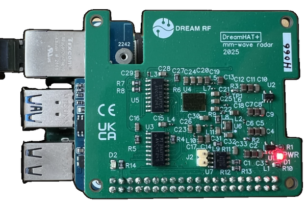

# PiRadar - BGT60TR13C Millimeter Wave Radar Driver

A high-performance Python driver for the [Dreamhat](https://shop.pimoroni.com/products/dream-hat-plus-radar?variant=55529907290491) Raspberry Pi Radar hat, featuring the Infineon BGT60TR13C chip.




For more demos see https://mmwaves.de/blogs/dreamhat/


## Features

- **High Performance**: Optimized SPI communication with 50 MHz clock support
- **Real-time Data Collection**: Efficient frame buffer management with configurable FIFO parameters
- **Multiple Output Formats**: Save data as NumPy arrays (.npy) or HDF5 files (.h5)
- **ZeroMQ Integration**: High-performance real-time data streaming with async support
- **Adaptive Control**: Real-time parameter control via ZMQ backchannel for AI/ML applications
- **Comprehensive Configuration**: YAML-based radar parameter configuration
- **Hardware Abstraction**: Clean GPIO and SPI interface management
- **Production Ready**: Comprehensive error handling and logging

## Hardware Specifications

- **Chip**: Infineon BGT60TR13C
- **Antennas**: 1 transmit, 3 receive
- **Frequency Range**: 58-63.5 GHz
- **Modulation**: FMCW (Frequency-Modulated Continuous Wave)
- **Field of View**: ~90 degrees
- **Maximum Range**: 15 meters
- **Tested Platform**: Raspberry Pi 5 with 50 MHz SPI clock

## Installation

### Prerequisites

- Python 3.9 or higher
- For hardware usage: Raspberry Pi with SPI and GPIO support enabled + Dreamhat radar hat
- For client usage: Any system with Python 3.9+ (no hardware required)

### Installation Options

#### Base Installation (Client-Only)
For remote access without hardware dependencies:
```bash
pip install piradar
```

#### Client with Visualization
For remote access with plotting and signal processing:
```bash
pip install piradar[client]
```

#### Full Installation (Hardware + Client)
For Raspberry Pi with the radar sensor:
```bash
pip install piradar[all]
```

#### Development Installation
```bash
# Clone the repository
git clone https://github.com/juhasch/piradar.git
cd piradar

# Create virtual environment
uv venv
source venv/bin/activate  # On Windows: venv\Scripts\activate

# Install in editable mode with all dependencies
uv pip install -e .[all,dev,test]
```

See [PACKAGE_STRUCTURE.md](PACKAGE_STRUCTURE.md) for detailed information about the package organization.

## Getting Started

### Basic Usage

1. **Verify Hardware Connection**
```bash
piradar check-id
```

2. **Monitor Radar Data**
```bash
# Monitor for 30 seconds with default settings
piradar monitor --duration 30
```

3. **Record Data to File**
```bash
# Save 100 frames as NumPy array
piradar record --frames 100 --output radar_data.npy
```

### Python API Example

```python
from piradar.hw import BGT60TR13C

# Initialize and collect data
with BGT60TR13C() as radar:
    radar.configure()  # Use default configuration
    radar.set_fifo_parameters(1024, 512, 256)
    radar.start()
    
    # Collect 100 frames
    frames = []
    for _ in range(100):
        frame = radar.frame_buffer.get(timeout=5.0)
        frames.append(frame)
    
    radar.stop()
    print(f"Collected {len(frames)} frames")
```

## Documentation

For detailed documentation, see the [docs](docs/) folder:

- **[Getting Started Guide](docs/getting-started.md)** - Installation and first steps
- **[CLI Reference](docs/cli.md)** - Command-line interface documentation
- **[Register Map](docs/registermap.md)** - Hardware register documentation
- **[ZeroMQ Guide](docs/zmq.md)** - Network streaming and bidirectional communication
- **[Adaptive Radar](docs/adaptive-radar.md)** - AI/ML integration and parameter control
- **[Configuration](docs/configuration.md)** - Radar configuration file format
- **[Development](docs/development.md)** - Contributing and development setup

## Examples

The [examples](examples/) directory contains demonstration scripts:

- `simple_radar_publisher.py` - Basic ZMQ data publishing
- `zmq_subscriber.py` - ZMQ client example
- `zmq_bidirectional_demo.py` - Bidirectional ZMQ communication
- `adaptive_radar_demo.py` - AI-driven parameter optimization
- `register_map_demo.py` - Direct register access demonstration

## Testing

Run the test suite:
```bash
# Unit tests only (no hardware required)
pytest tests/unit/

# All tests (requires hardware)
pytest tests/
```

## Troubleshooting

### Common Issues

1. **SPI Permission Denied**
   ```bash
   sudo usermod -a -G spi $USER
   # Reboot required
   ```

2. **GPIO Access Denied**
   ```bash
   sudo usermod -a -G gpio $USER
   # Reboot required
   ```

3. **Chip Not Detected**
   - Check physical connections
   - Verify GPIO pin assignments (default: RST=12, IRQ=25)
   - Ensure proper power supply

### Debug Mode

Enable detailed logging:
```bash
piradar --log-level DEBUG check-id
```

## License

This project is licensed under the MIT License - see the [LICENSE](LICENSE) file for details.

## Contributing

Contributions are welcome! Please see [DEVELOPMENT.md](docs/development.md) for guidelines.

## Acknowledgments

- [Pimoroni](https://shop.pimoroni.com/) for the Dreamhat hardware
- [Infineon](https://www.infineon.com/) for the BGT60TR13C chip
- The Raspberry Pi Foundation for the amazing platform
